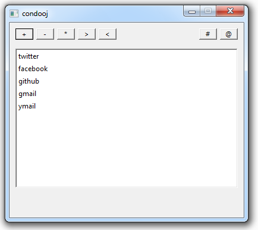
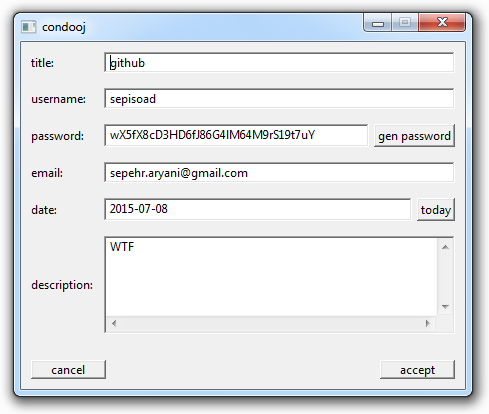
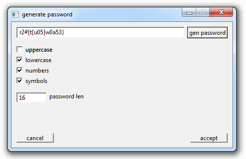

# Condooj

Condooj is a lightweight and small password manager. It is entirely written in [nim](http://nim-lang.org/) language. Currently Windows(x86) is the only tested OS, Linux(Ubuntu) should be ok too.

The code is licensed under GPLv3 license.

##Version
0.1.0

##Contact me
email: [sepehr.aryani@gmail.com](sepehr.aryani@gmail.com)
twitter: [@sepisoad](https://twitter.com/sepisoad)
github: [@sepisoad](https://github.com/sepisoad)